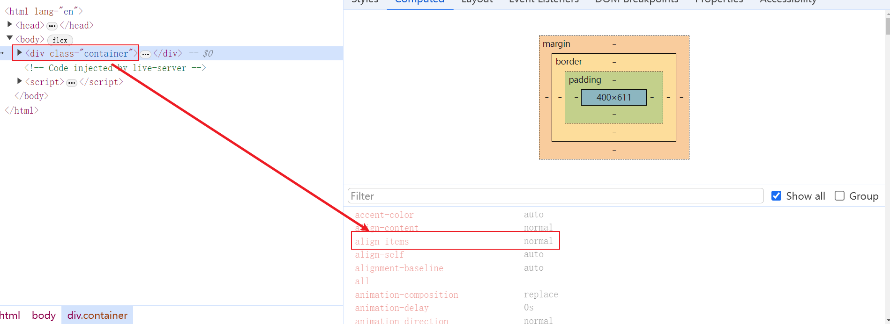
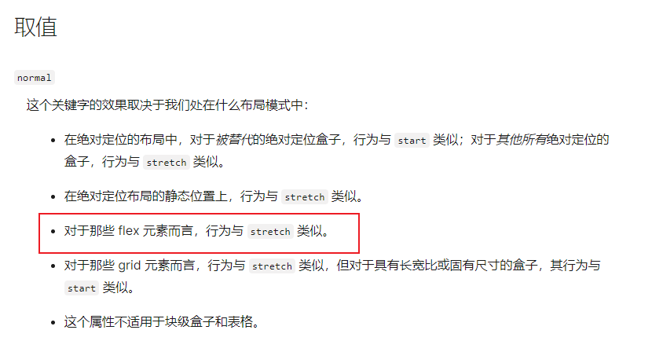

## Form Validator (Intro Project)

Simple client side form validation. Check required, length, email and password match

## Project Specifications

- Create form UI
- Show error messages under specific inputs
- checkRequired() to accept array of inputs
- checkLength() to check min and max length
- checkEmail() to validate email with regex
- checkPasswordsMatch() to match confirm password

## my Note

- 为什么在注释 align-items: center;后，container 的高度就是 body 的高度呢，这是因为 display: flex 的一个默认属性是 align-items: normal。而 normal 取值在 flex 布局下和 stretch 效果一样，这意味着，如果未设置其他对齐方式，flex 项目会自动在交叉轴上拉伸以匹配容器的高度。如图所示
  
  
- 为什么视口高度小于 611px 会有 container 元素左右移动一下，因为小于 611px 时，视口高度小于 container 元素高度了，导致左边出现了滚动条，间接使得 body 元素的宽度变了，所以 container 元素的居中变化了。
